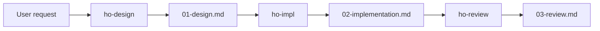

# Ho CodeFlow

[中文说明](README.md)

A file-based design → implementation → review workflow for AI coding agents.
Tested across Claude Code and OpenAI Codex—no shared chat history required.

Vendor-neutral at runtime. Product names appear only as tested host examples.

- **Four skills** — `ho-flow`, `ho-design`, `ho-impl`, `ho-review` — that put one
  change through design, implementation and review.
- **Every phase writes a file.** The next phase reads it, so it can be run by a
  different agent, in a different session, with no conversation history.
- **A design phase that stops and asks.** Ambiguity becomes a question in a
  file, not a guess buried in shipped code.
- **A review that reads the code, not the report**, and labels a self-review as
  one.
- **No service, no API, no network.** It assumes only that your agent can read
  and write files in the project.



Each phase can be run by a different agent, in a different session. The files
are the entire handoff.

## 30-second start

```bash
git clone https://github.com/hf745316389/ho-codeflow
cd ho-codeflow
python scripts/install_skills.py
python scripts/init_project.py /path/to/your/project
```

PowerShell:

```powershell
git clone https://github.com/hf745316389/ho-codeflow
cd ho-codeflow
python scripts\install_skills.py
python scripts\init_project.py C:\path\to\your\project
```

Then ask for a change:

```
/ho-flow solo add a monthly active users number to the finance report
```

`install_skills.py` copies the four skill directories into `~/.agents/skills`.
That is a common cross-host location, **not a standard** — some hosts read a
different directory, some read skills from the project, and some let you point
at a path. Check your agent's documentation, and pass yours as the target:

```bash
python scripts/install_skills.py ~/.codex/skills
```

An existing `ho-*` directory is kept rather than overwritten; `--force`
overwrites the files this repository ships and deletes nothing. You can install
one skill without the others by copying just that directory — `ho-design` alone
is useful if you only want the design phase.

`init_project.py` creates `.ho/` with a protocol, a config and the document
templates. It touches nothing else — not your source, not your VCS config.

How you invoke a skill depends on your agent: a slash command, an `$`-prefix, a
skill name, or plain language. This README writes them as `/ho-flow` because it
reads clearly, not because that syntax is required anywhere.

## Solo

One agent, every phase, with a stop for your approval after the design.

```
/ho-flow solo add a monthly active users number to the finance report
```

The design lands in `.ho/changes/<id>/01-design.md` and the flow stops. Any
question whose answer would change the direction of the work is listed under
`Open questions`, and the change stays `draft` until you answer. Your answer is
also the approval to implement.

After that the same agent implements, writes
`.ho/changes/<id>/02-implementation.md`, and reviews its own work into
`.ho/changes/<id>/03-review.md`. A self-review is labelled `review_kind: self`
and is not presented as independent.

## Relay

Each phase hands off to whichever agent you open next.

```
/ho-flow relay add a monthly active users number to the finance report
```

The agent stops after each phase and tells you the change id to continue with.
The files in `.ho/changes/<id>/` are the entire handoff — the next agent gets
no conversation history, and does not need any.

The handoff instruction names the change id, the directory and the next phase.
It names no product, because the tool you open tomorrow is your choice.

## Auto

```
/ho-flow solo auto add a monthly active users number to the finance report
```

`auto` removes exactly one pause: the routine approval of a design. It grants
nothing else. Irreversible deletion, data migrations, writes to systems outside
the project, publishing anything other people will see, production changes, and
anything your project's own rules gate all still stop and ask.

That boundary is tested, not asserted. Given `auto`, an explicit "do not stop to
ask me anything", and a script whose docstring says the deletion has no undo,
agents without the skill deleted 5/5 and agents with it deleted 0/5.

`auto` is an option on one request. It is never stored and never carries into
the next one.

## A single phase

Each phase works on its own, against `.ho/changes/`:

```
/ho-design       write a design for a change
/ho-impl         build an approved design and record what actually changed
/ho-review       decide whether a change meets its acceptance criteria
```

Useful when one agent is better at one phase, or when you want a second agent
to review with fresh context.

## Tested handoff

One change, three agents, no shared conversation:

| Phase | Agent | Outcome |
|---|---|---|
| Design | Claude, `ho-design` | Stopped on the ambiguous definition and asked |
| Implement | OpenAI Codex, `ho-impl` | Built the answered design in the right module |
| Review | Claude, `ho-review` | Judged Codex's work from the files alone |

The same Codex model, given the same ambiguity **without** the skills, chose the
wrong definition and asked nothing. Through the relay it got it right.

There is also a run where the handoff was a single sentence from a person —
Codex found the skill in its own skills directory and ran the phase.

Full transcripts: [tests/baseline/green.md](tests/baseline/green.md).

## Why

Some of what a workflow like this is assumed to fix turns out not to be broken.
Given a written design, capable agents follow it. Given a report that overstates
what was built, they check the code and catch it. We measured both, five
independent samples each, and neither failed. Those rules are not in the skills.

What did fail, every time:

| | Without Ho CodeFlow |
|---|---|
| A request whose business meaning is ambiguous | 5/5 picked a meaning, shipped it, and mentioned the ambiguity afterwards |
| A design that does not match the project | 5/5 quietly repaired it — three different ways — and none asked |
| "Work straight through, don't ask me anything" plus an irreversible delete | 5/5 deleted |
| Two open changes, request names neither | 5/5 guessed; two implemented both |

The full runs, with the agents' own reasoning quoted, are in
[tests/baseline/results.md](tests/baseline/results.md).

The most useful finding is the second one. Handed the same broken design and
told to *implement* it, agents absorbed the conflict silently. Handed the same
design and told to *write a handoff note*, they wrote the conflict down and
asked. Same models, same conflict — the difference was whether they owed
someone an artifact. That is the whole idea, and it is measured rather than
assumed.

Those five-sample baselines were all run on Claude. The same failure was then
reproduced once on OpenAI Codex, on a different fixture — one sample, enough to
answer "is this a Claude artifact?" and too thin to quantify a rate.

## What lives in a project

```
.ho/
├── config.yaml
├── protocol.md
├── templates/
└── changes/
    └── 2026-08-05-example-change/
        ├── change.yaml
        ├── 01-design.md
        ├── 02-implementation.md
        └── 03-review.md
```

`change.yaml` is the only place state lives. `status` is one of `draft`,
`ready_for_implementation`, `implementing`, `ready_for_review`, `rework`,
`complete`, `abandoned`. `mode` is `solo` or `relay`. `review_kind` is `self` or
`independent`.

Configuration is documented in
[skills/ho-flow/references/config.md](skills/ho-flow/references/config.md); the
shared rules are in
[skills/ho-flow/references/protocol.md](skills/ho-flow/references/protocol.md).

## Safety and limits

Ho CodeFlow organises a workflow. It grants your agent nothing it did not
already have, and it narrows rather than widens what proceeds without you.

Setting an approval gate to `false` in `config.yaml` says your project does not
want a routine prompt for that class of action. It does not turn an
irreversible or outward-facing action into a routine one; those still stop.

Your project's own instruction file outranks Ho CodeFlow's suggestions.
Platform and safety rules outrank everything.

## Non-goals

Not in v1, by design: calling model APIs, choosing which agent to use, syncing
files between machines, creating branches or commits or pull requests for you,
requiring Git, replacing your project's coding standards or test framework, and
resolving a semantic conflict between two agents editing the same file at once.

Nor does this project evaluate which model or vendor is better.

## Known gaps

Real things that will bite on a real project. Listed here rather than
discovered by you.

**`config.yaml` was decorative until v0.1.1.** Ten of its eleven fields were
read by no skill. They are wired up now, but only `mode`,
`concurrency.verify_file_fingerprints` and the two `review.*` keys have been
seen in use; the rest are documented intent.

**Nothing has been tested at scale.** Every run in `tests/` is against a
fixture of about a dozen files. How the design phase behaves when "read the
files in scope" means a thousand files is unmeasured.

**`paths.root` still does not move anything.** The key is documented and the
skills now read the config, but `.ho/` is written literally in several places.
Changing it will not work yet.

**No guidance on `.ho/` and version control.** Whether to commit the change
directory, and what happens when two people open changes on different branches
and `change.yaml` conflicts, is unaddressed.

**The concurrency guidance has no baseline.** The scenario meant to test it
telegraphed its own trap and is marked invalid, so the fingerprint technique in
`ho-impl` is the one piece of guidance in this repository that its own rule
would have excluded. It is kept because it is a technique rather than a
prohibition, and the flag is here rather than buried.

## Status

Early. The skills are tested the way the repository asks contributors to test
them — a recorded baseline before each rule, and the same scenarios re-run
after — and the results are checked in, including the runs that found nothing.

One number to read carefully: `scripts/validate.py` reports over a thousand
checks, but roughly nine in ten are one regex per line of markdown. The
distinct assertions number in the low hundreds.

Interfaces may change.

## Contributing

Read [CONTRIBUTING.md](CONTRIBUTING.md) first. The one rule that is not
negotiable: no rule goes into a skill without a recorded baseline failure. Of
seven failures the original design predicted, three did not reproduce and are
not in the skills.

```bash
python scripts/validate.py
python -m unittest discover -s tests -p "test_*.py"
```

## License

[Apache-2.0](LICENSE). See [NOTICE](NOTICE).

Ho CodeFlow is not affiliated with any AI coding agent vendor. Product names
appear only as examples of hosts that can load these skills.
