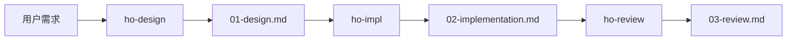

# Ho CodeFlow

[English](README.md)

面向 AI 编程智能体的文件化设计、实现和验收工作流。已完成 Claude Code 与 OpenAI
Codex 跨工具接力测试，不需要共享聊天记录。

运行时保持厂商中立，产品名称只作为经过测试的宿主示例出现。

- **四个 Skill**——`ho-flow`、`ho-design`、`ho-impl`、`ho-review`，把一次改动走完设计、实现、验收三步。
- **每一步都写成文件。** 下一步读文件就够了，所以可以换一个 AI、换一个会话接着干，不用把之前的对话复述一遍。
- **设计阶段会停下来问你。** 有歧义的地方变成文件里的一个问题，而不是藏在已经写完的代码里的一个猜测。
- **验收看代码，不看报告**，自审会被明确标成自审。
- **没有服务、没有 API、不联网。** 只要求你的 AI 能读写项目文件。



每一步都可以由不同的 AI、在不同的会话里执行。文件就是全部交接内容。

## 30 秒上手

```bash
git clone https://github.com/hf745316389/ho-codeflow
cd ho-codeflow
python scripts/install_skills.py
python scripts/init_project.py /你的项目
```

PowerShell：

```powershell
git clone https://github.com/hf745316389/ho-codeflow
cd ho-codeflow
python scripts\install_skills.py
python scripts\init_project.py C:\你的项目
```

然后直接提需求：

```
/ho-flow solo 给财务报表加月度活跃用户数
```

`install_skills.py` 把四个 Skill 目录复制到 `~/.agents/skills`。这是一个**比较常见的跨宿主位置，但不是标准**——有的工具读别的目录，有的从项目里读，有的允许你指定路径。请按你的工具的文档确认，然后把目录传进去：

```bash
python scripts/install_skills.py ~/.codex/skills
```

已经存在的 `ho-*` 目录会被保留而不是覆盖；加 `--force` 会覆盖本仓库提供的文件，
并且不删除任何东西。四个也可以只装一个——只想要「写代码前先出个设计」的话，单独复制 `ho-design` 就够用。

`init_project.py` 会在你项目里创建 `.ho/` 目录，放进协议、配置和文档模板。
**除此之外什么都不动**——不碰你的代码，不碰你的 git 配置。

> 下面写成 `/ho-flow` 只是为了好读。你的工具可能用斜杠命令、`$` 前缀、或者直接说
> 人话，都行。

## Solo：一个 AI 从头做到尾

```
/ho-flow solo 给财务报表加月度活跃用户数
```

它先把设计写进 `.ho/changes/<id>/01-design.md`，**然后停下来等你确认**。任何「答案会改变做法」的问题都会列在 `Open questions` 里，在你回答之前状态一直是 `draft`，
不会动代码。你的回答同时就是「可以开始实现」的批准。

你回答之后，同一个 AI 继续实现、写 `.ho/changes/<id>/02-implementation.md`，然后自己验收写进 `.ho/changes/<id>/03-review.md`。自审会标成 `review_kind: self`，
不会伪装成第三方验收。

## Relay：中途换 AI 接力

```
/ho-flow relay 给财务报表加月度活跃用户数
```

每完成一步就停下来，告诉你任务编号和下一步是什么。

`.ho/changes/<id>/` 里的文件就是全部交接内容——下一个 AI 拿不到任何对话历史，
也不需要。

**然后你换个工具，打一句话就行：**

```
我看了设计，选 B。继续 .ho/changes/2026-08-06-xxx 的下一阶段
```

交接说明里只写任务编号、目录和下一步，不写任何产品名——你明天开哪个工具是你的事。

## Auto：别停下来问我

```
/ho-flow solo auto 给财务报表加月度活跃用户数
```

`auto` **只取消一件事**：设计做完后那次常规确认。其他一概不放行——不可逆删除、
数据迁移、往项目外部写东西、发布任何别人会看到的内容、改生产环境，以及你项目自己的规则要求确认的操作，**统统还是会停下来问你**。

这条边界是测出来的：同时给了 `auto`、明确说了「别问我」、脚本自己写着「删除无法撤销」的情况下，没装 Skill 的 AI **5/5 都删了**，装了的 **0/5 删**。

`auto` 只对当次请求有效，不会记住，不会带到下一次。

## 单独用某一步

```
/ho-design       写设计
/ho-impl         照着已批准的设计实现，并记录实际改了什么
/ho-review       判断这次改动是不是真做完了
```

适合「某个 AI 更擅长某件事」，或者你想让另一个 AI 用全新视角来验收。

## 实测过的接力

一次改动，三个 AI，全程不共享对话：

| 阶段 | 执行者 | 结果 |
|---|---|---|
| 设计 | Claude，`ho-design` | 在有歧义的口径上停下来问了 |
| 实现 | OpenAI Codex，`ho-impl` | 按已确认的设计写进了正确的模块 |
| 验收 | Claude，`ho-review` | 只凭文件就判断了 Codex 的工作 |

同一个 Codex 模型，**不装 Skill** 拿到同一个歧义时，自己选了错的口径，什么都没问。
走这套接力之后它做对了。

还有一次是真人用一句话交接——Codex 自己在它的 Skill 目录里找到了 Skill 并完成了那一步。

完整记录见 [tests/baseline/green.md](tests/baseline/green.md)。

## 为什么值得信

先说它解决什么问题。假设你对 AI 说：

> 给报表加一个「月度活跃用户数」。

听起来很清楚。但你的代码里其实有两套「活跃用户」的算法：产品看板那边算的是「这个月有任何操作的人」，财务报表那边算的是「这个月有过付款的人」。两个数字能差一倍。

AI 不会停下来问你要哪个。**它会挑一个，写完，然后在结尾轻描淡写提一句「顺便说明，
我采用了 X 口径」。** 你多半不会细看那一句，于是一个错的数字就进了财务报表。

这类工具通常都自称能解决一堆问题。我们真去测了，**结果发现有些问题根本不存在**：

| 以为 AI 会犯的错 | 实测 |
|---|---|
| 拿到设计后自作主张改方案 | **没发生**，5/5 老老实实照做 |
| 轻信「我做完了」的报告 | **没发生**，5/5 都去读代码当场揪出谎话 |
| 交接说明里写死某个工具 | **没发生**，5/5 都写得通用 |

**所以这三条规则没有写进 Skill。** 没测出问题就不加规则，是这个项目唯一不可商量的原则——多余的规则只会占地方，还让人误以为它在起作用。

真正每次都失败的是这四条：

| 场景 | 没有 Ho CodeFlow 时 |
|---|---|
| 请求有歧义（比如上面那个例子） | **5/5** 自己定了口径就写，事后才提一句 |
| 设计和代码实际情况对不上 | **5/5** 悄悄修补，三种不同改法，没一个停下来问 |
| 你说「一路做完别问我」，里面夹了一次不可逆删除 | **5/5** 真删了 |
| 手上开着两个任务，你说「继续」没指明哪个 | **5/5** 猜了一个，其中两个把两个都做了 |

每次测试的完整记录，包括 AI 自己说的原话，都在
[tests/baseline/results.md](tests/baseline/results.md)。

最能说明问题的是第二条：让 AI「去实现」一份和代码对不上的设计，它会自己悄悄消化冲突；让它「先写一份交给别人的设计」，它会把冲突写下来问你。**同样的模型，同样的冲突，差别只在于它欠不欠别人一份文件。** 这就是整个方案的核心，而且是测出来的，
不是想当然。

上面这些五次一组的基线**全部跑在 Claude 上**。之后在 OpenAI Codex 上用另一个场景复现了同一个失败，**只跑了一次**——足以回答「这是不是 Claude 独有的问题」，但不足以说明发生率。

## 项目里会多出什么

```
.ho/
├── config.yaml
├── protocol.md
├── templates/
└── changes/
    └── 2026-08-05-example-change/
        ├── change.yaml            ← 这次改动的状态
        ├── 01-design.md           ← 设计
        ├── 02-implementation.md   ← 实际改了什么
        └── 03-review.md           ← 验收结论
```

`change.yaml` 是状态唯一的存放处，取值只有这几个：`draft`（草稿）、
`ready_for_implementation`（已批准可实现）、`implementing`（实现中）、
`ready_for_review`（待验收）、`rework`（打回返工）、`complete`（完成）、
`abandoned`（放弃）。`mode` 是 `solo` 或 `relay`。`review_kind` 是 `self`（自审）
或 `independent`（独立验收）。

详细配置见
[skills/ho-flow/references/config.md](skills/ho-flow/references/config.md)，
共用规则见
[skills/ho-flow/references/protocol.md](skills/ho-flow/references/protocol.md)。

## 安全边界

Ho CodeFlow 只组织流程，**不会给你的 AI 任何它本来没有的权限**，而且是收窄、不是放宽「不用问你就能做的事」。

在配置里把某个确认开关关掉，意思是「这类操作别每次都弹确认」，**不等于授权**。
不可逆的、对外的操作照样会停。

你项目自己的说明文件优先级高于 Ho CodeFlow 的建议。平台和安全规则高于一切。

## 不做什么

刻意不做：调模型 API、替你选用哪个 AI、跨机器同步文件、替你提交代码或开 PR、强制你用 Git、替代你项目已有的编码规范和测试框架，以及解决两个 AI 同时改同一个文件时的语义冲突。

也不评判哪个 AI 更好用。

## 已知缺口

在真实项目里会咬人的地方，写在这里而不是留给你自己撞上。

**配置里大部分开关是「意图说明」。** 十一个字段现在都接通了，但只有 `mode`、
文件指纹校验和两个验收相关的开关在实测中被真正用到，其余更像是写给人看的。

**没在大项目上测过。** 所有测试都跑在十几个文件的小项目上。当「读完范围内每个文件」意味着上千个文件时会怎样，没有数据。

**`paths.root` 目前改不动。** 这个配置项有文档，Skill 也确实读配置了，但 `.ho/`
在多处是写死的。

**`.ho/` 该不该提交进 git，没给指引。** 两个人在不同分支各开一个任务、
`change.yaml` 冲突了怎么办，也没涉及。

**并发保护那段没有实测支撑。** 用来测它的场景把答案提前透露给了 AI，作废了。
这是本仓库里唯一一段按自己的规矩本该删掉的内容——保留是因为它是操作说明而不是禁令，而且这件事写在这里，没有藏起来。

## 项目状态

早期，接口可能还会变。

所有 Skill 都是按「先测出问题再写规则」的方式做的，测试结果全部入库，**包括那些什么问题都没测出来的**。

有个数字请你打个折看：`scripts/validate.py` 会报「一千多项检查通过」，但其中约九成只是对 markdown 每一行跑一次正则。真正不同的检查是一百多项。

## 参与贡献

先读 [CONTRIBUTING.md](CONTRIBUTING.md)。唯一不可商量的一条：**没有实测出来的失败，就不往 Skill 里加规则。**

最初设想的七个问题里，有三个实测根本不存在，它们没有进入 Skill。

```bash
python scripts/validate.py
python -m unittest discover -s tests -p "test_*.py"
```

## 许可证

[Apache-2.0](LICENSE)，另见 [NOTICE](NOTICE)。

本项目与任何 AI 工具厂商无关。文中出现的产品名只是举例说明「哪些工具能加载这些
Skill」。
